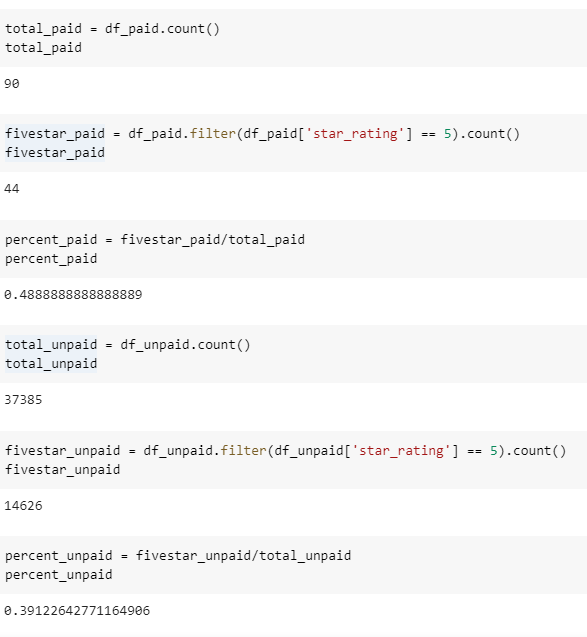

# Amazon_Vine_Analysis - Module 16 Challenge

## Amazon Vine Analysis

The purpose of this project is to complete an analysis of the effectiveness of vine paid reviews on Amazon products in the Video Game category, and the bias of the paid reviews. The cloud ETL process was used to process the data, then the vine information was analyzed in order to see the effectiveness of the reviews.

## Resources Used
- Data Source: https://s3.amazonaws.com/amazon-reviews-pds/tsv/amazon_reviews_us_Video_Games_v1_00.tsv.gz
- Software: Google Collab, pgAdmin, AWS

## Analysis and Results

### Results

Formulas and results used can be found in this image from the Google Collab files. This data was filtered to exclude data with a 'total_votes' count less then 20,

- Of the data with a total_votes count greater then 20, there were a total of 90 vine paid reviews and 37385 unpaid reviews.
- From that data, there were 44 5-star paid reviews and 14626 unpaid 5-star reviews.
- Based on percentage, 48.9% of paid reviews were 5 star reviews, and 39.1% of unpaid reviews were 5 star.

## Summary

Based on the percentage of 5-star reviews of paid and unpaid reviews, there can be a small amount of positivity bias with paid reviews, with about 10% more positive reviews. However the significantly small sample size of paid reviews in comparison to unpaid reviews may affect the accuracy of results. Increasing the data to be analyzed by using different Amazon categories in similar fields of electronics may help address that lack of data.

As well, the non-paid review data can be biased by 1-star reviews commonly left when people are angry with a product for various reasons, and can be made more often then other review types. A histogram of the paid and unpaid data can be produced in order to analyze the 1-5 star review distributions which may help indicate whether the positivity bias actually has a large effect here.